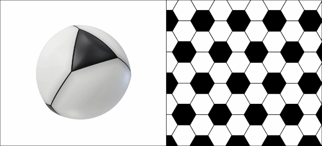

# Andy's Afternoon Amble

Andy the ant has moved on from his classic ‘Telstar’ [soccer ball](https://www.janestreet.com/puzzles/andys-morning-stroll-index/) homeland to live on a simpler spherical surface consisting of four white hexagons that are surrounded by alternating black triangles and white hexagons (three of each), and four black triangles surrounded by three white hexagons. To us this land is a truncated tetrahedron blown up into a sphere we see above on the left. Due to Andy’s tiny size and terrible eyesight, he doesn’t notice the curvature of the land and avoids the black triangles because he suspects they may be bottomless pits.

Much like his morning routine, every afternoon he wakes up from his nap on a white hexagon, leaves some pheromones to mark it as his special *home* space, and starts his random amble. Every step on this walk takes him to one of the three neighboring white hexagons with equal probability. He ends his amble as soon as he first returns to his home space, which he recognizes but cannot distinguish the edges of (i.e. he doesn’t know if he returned across the same edge as he left). As an example, on exactly 1/3 of afternoons Andy’s amble is 2 steps long, as he randomly visits one of the three neighbors, and then has a 1/3 probability of returning immediately to the home hexagon.

This afternoon his truncated tetrahedral homeland bounced through the very same kitchen with an infinite regular hexagonal floor tiling consisting of black and white hexagons, shown above on the right. In this tiling every white hexagon is surrounded by alternating black and white hexagons, and black hexagons are surrounded by six white hexagons. Andy fell off the ball and woke up on a white hexagon. He didn’t notice any change in his surroundings, and goes about his normal amble.

Throughout his walk, Andy remembers the turns he’s taken. Let p be the probability that by the end of his afternoon amble on this new land he has discovered that he is no longer on the truncated tetrahedral sphere. **Find p in exact terms**.